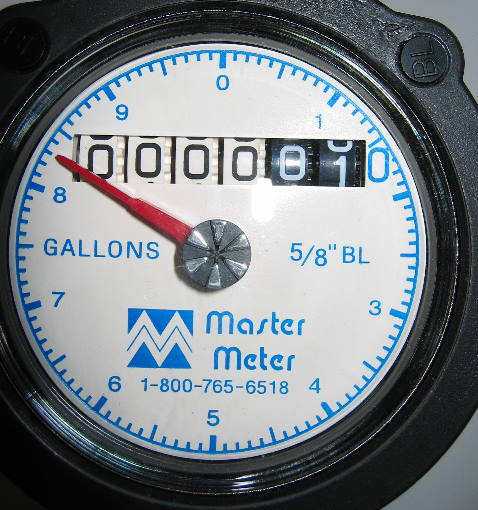

# 简单的滚动效果

VueToCounter 提供了下列组件，他们用于滚动不同类型的数据：

- [VueToNumber](#使数字滚动)：`number`，`bigint`
- [VueToDatetimeDuration](#倒计时效果)：`Date`
- [VueToString](#字符串也可以滚动)：`string`

仅使用默认的配置，即可获得一个看起来不错的滚动效果。

::: tip
点击 <button class="border border-solid p-2">切换</button> 按钮，观察数值的改变。
:::

## 使数字滚动

想像一下，现实生活中的水表，它会不断地滚动，显示当前的用水量。VueToCounter 可以帮助你实现这样的效果。

<figure>
  
  <figcaption class="text-xs italic"><a href="http://creativecommons.org/licenses/by-sa/3.0/" title="Creative Commons Attribution-Share Alike 3.0">CC BY-SA 3.0</a>, <a href="https://commons.wikimedia.org/w/index.php?curid=107725262">Link</a></figcaption>
</figure>

<DemoContainer><BasicNumberDemo /></DemoContainer>
::: details 点击查看代码
::: code-group
<<< @/components/BasicNumberDemo.vue{vue} [BasicNumberDemo]
<<< @/components/DemoContainer.vue{vue} [DemoContainer]
:::

## 倒计时效果

我相信你已经见过很多的倒计时，但大部分的变化是生硬的，没有过渡。VueToCounter 可以让你的倒计时效果更加平滑。

<DemoContainer><BasicDatetimeDurationDemo /></DemoContainer>
::: details 点击查看代码
::: code-group
<<< @/components/BasicDatetimeDurationDemo.vue{vue} [BasicDatetimeDurationDemo]
<<< @/components/DemoContainer.vue{vue} [DemoContainer]
:::

## 字符串也可以滚动

看到[首页](/)的滚动标题了吗？在静态网页上，有个会动的东西是很有趣的，你会马上被他吸引。

::: tip
请注意，默认配置下最长支持 **17** 个字符。如果你需要更多的字符长度，请参阅[如何解除字符长度限制](../optional-dependencies#如何解除字符长度限制)。
:::

<DemoContainer><BasicStringDemo /></DemoContainer>
::: details 点击查看代码
::: code-group
<<< @/components/BasicStringDemo.vue{vue} [BasicStringDemo]
<<< @/components/DemoContainer.vue{vue} [DemoContainer]
:::

## 下一步

- 要了解如何设置语言敏感的数字格式，日期和时间格式，请查看[本地化](locale-usage.md)。
- 如果想自定义组件外观或过渡动画，请查看[自定义样式](styled-usage.md)和[自定义动画](animated-usage.md)。
